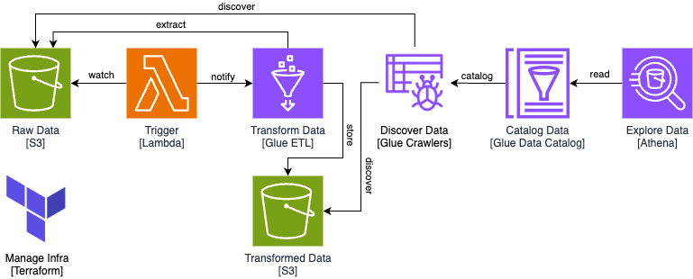

# Serverless Data Lake (Esdiel) using Amazon Web Service

## Background
This project serves as my learning documentation.

## High-Level Architecture

<picture>
    <source media="(prefers-color-scheme: dark)"  srcset="docs/assets/hla-dark.png">
    <source media="(prefers-color-scheme: light)" srcset="docs/assets/hla-light.png">
    
</picture>

This project sets up a simple serverless data lake using AWS services, managed with Terraform. As I write this documentation, the project only limited to example data type like the `data.csv`.

### Workflow
1.	Raw Data (S3): Stores incoming raw data.
2.	Trigger (Lambda): Watches for new data and triggers the transformation process.
3.	Transform Data (Glue ETL): Cleans and processes the raw data, storing the results in another S3 bucket.
4.	Transformed Data (S3): Stores the transformed data.
5.	Discover Data (Glue Crawlers): Scans the raw and transformed data and creates metadata.
6.	Catalog Data (Glue Data Catalog): Stores metadata, making data available for querying.
7.	Explore Data (Athena): Allows querying of the processed data via SQL.

### Infrastructure Management
Terraform automates the provisioning of AWS resources.

## Setup
### Prerequisites
- Terraform (1.10.5)
- AWS CLI (2.17.32)
- Python (3.11)
- GNU Make (3.81)

### Steps
1. Clone the repository to your local repository.
2. Ensure you already have configured AWS credentials in your device.

#### Terraform
1. Navigate to **serverless-data-lake** directory, then navigate to **terraform** directory.
2. Create a `.tfvars` file in the terraform directory using the `.tfvars.template`.
3. Adjust the variable `aws_profile` if you have multiple profile in your device, otherwise, just fill `default` as the variable value. Adjust other variables.
4. Run `terraform init` to initialize all terraform resources.
5. Run `terraform plan -var-file=.tfvars -out=plan.tfplan` to create execution plan.
6. Run `terraform apply "plan.tfplan"` to apply the execution plan.
7. Run `terraform show` to inspect the current state.

#### Extra Steps
1. Upload `data.csv` to the `data/` folder in the source bucket using AWS CLI or AWS Console.
2. Check your AWS Glue ETL Job and your AWS Glue Data Catalog.

Ah, there you go!

## References
- [AWS Documentation](https://docs.aws.amazon.com/)
- [Terraform Registry](https://registry.terraform.io/)
- [Spacelift](https://docs.spacelift.io/vendors/terraform)
