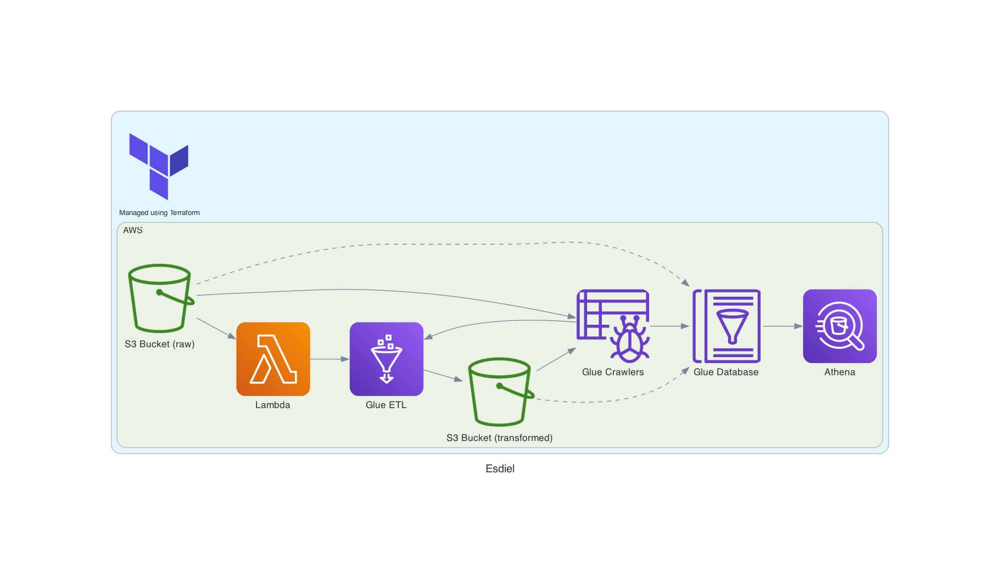

# Serverless Data Lake (Esdiel) using Amazon Web Service

  <a href="https://raw.githubusercontent.com/enchant3dmango/awesome/main/serverless-data-lake/files/esdiel.png">
    <picture>
      <source  srcset="./files/esdiel.png">
      
    </picture>    
  </a>

### Setup
#### Prerequisites
- Terraform (1.9.2)
- AWS CLI (2.17.11)
- Python (3.8)
- GNU Make (3.81)

#### Steps
- Make sure to clone the repository first to your local repository!
- Also make sure you already have AWS secret key and access key on your local directory.
- Create a profile in your AWS config and credentials file then adjust the variable **aws_profile** in **variables.tf**.
- Adjust all variables in **variables.tf** if needed.

##### Makefile
1. Navigate to **serverless-data-lake** directory.
2. Run `make install` to install dependencies.
3. Run `make format` to format all Python code in serverless-data-lake directory.
4. Run `make lint` to lint all Python code in serverless-data-lake directory.

##### Terraform
1. Navigate to **serverless-data-lake** directory, then navigate to **terraform** directory.
2. Run `terraform init` to initialize all terraform resources.
3. Run `terraform plan -out=plan.tfplan` to create execution plan.
4. Run `terraform apply "plan.tfplan"` to apply the execution plan.
5. Run `terraform show` to inspect the current state.

##### Extra Steps
1. Upload data.csv to the data folder in the source bucket using AWS CLI or AWS Console.
2. Ah, there you go!

### References
- [AWS Documentation](https://docs.aws.amazon.com/)
- [Terraform Registry](https://registry.terraform.io/)
- [Spacelift](https://docs.spacelift.io/vendors/terraform)
